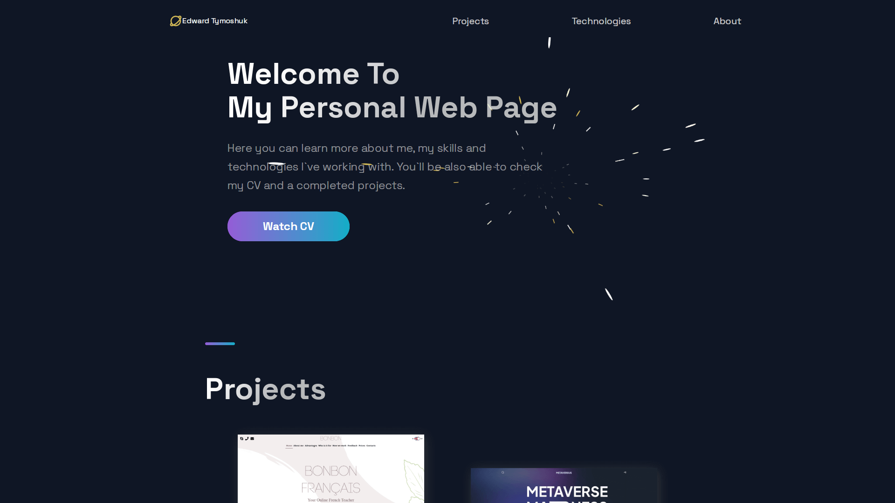

# My Personal Website

## Overview
Welcome to my personal website repository. This website serves as a portfolio and personal CV showcase, providing visitors with an overview of my skills, experiences, and contact information.

## Features
- **Portfolio:** Explore my projects and view detailed information about each one.
- **CV Download:** Download my CV (resume) directly from the website.
- **Responsive Design:** The website is optimized for desktop, tablet, and mobile devices.
- **Contact Form:** Reach out to me using the built-in contact form.

## Technologies Used
- **React:** A JavaScript library for building user interfaces.
- **Next.js:** A framework for building React applications.
- **Styled-components:** A CSS-in-JS library for styling components.

## Installation
1. Clone this repository: `git clone https://github.com/EdwardTymoshuk/my-personal-website.git`
2. Navigate to the project directory: `cd my-personal-website`
3. Install dependencies: `npm install`

## Usage
- Start the development server: `npm run dev`
- Access the website in your browser at `http://localhost:3000`

## CV
You can download my CV (resume) in PDF format directly from the website.

## Contributing
Contributions are welcome! If you'd like to contribute to this project, please follow the standard GitHub fork and pull request process.

## License
This project is licensed under the MIT License. See the [LICENSE](LICENSE) file for details.

## Contact
For any inquiries or feedback, please contact me:
- Edward Tymoshuk
- Email: [eduard.tymoshuk@gmail.com](mailto:eduard.tymoshuk@gmail.com)
- GitHub: [https://github.com/EdwardTymoshuk](https://github.com/EdwardTymoshuk)
